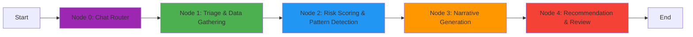

# 🕵️ High-Risk Investigation Agent

An automated case analyst system that performs end-to-end investigation of flagged entities using a multi-agent workflow built with LangGraph.

## Overview

The High-Risk Investigation Agent is an intelligent system that automates the investigation process for flagged users, transactions, or accounts. It uses a graph-based workflow with four specialized agent nodes that work together to analyze entities and provide actionable recommendations.

## Architecture



### Agent Nodes

#### Node 0: Chat Router (Entry Point)
- **Input**: Chat message (natural language) or structured input (entity_id/entity_type)
- **Action**: Parses input to extract entity information using regex pattern matching
- **Patterns Recognized**:
  - Standard IDs: `USER_123`, `ACC_456`, `TXN_789`
  - Natural language: "Investigate user USER_001", "Check account ACC_999"
- **Output**: Populated `entity_id` and `entity_type` → routes to Triage, or ends if no entity found

#### Node 1: Triage and Data Gathering
- **Input**: Alert/Flagged Entity ID
- **Action**: Gathers comprehensive data from multiple sources (user profile, activity logs, connected accounts, past flags, transactions)
- **Output**: Comprehensive Data Package

#### Node 2: Risk Scoring and Pattern Detection
- **Input**: Data Package
- **Action**: Calculates dynamic risk score (0-100) and detects known high-risk patterns
- **Patterns Detected**:
  - Wash trading (circular gifting patterns)
  - Rapid follow/unfollow cycles
  - Sudden high-value cash-outs
  - VPN/proxy usage with high-value activities
  - Multi-account coordination
  - Repeat offender behavior
- **Output**: Risk Assessment Report

#### Node 3: Narrative Generation
- **Input**: Data Package + Risk Assessment
- **Action**: Creates clear, plain-language investigation narrative using LLM
- **Output**: Investigation Narrative with executive summary, timeline, evidence, and impact assessment

#### Node 4: Recommendation and Review
- **Input**: All previous data + Policy documents (RAG)
- **Action**: Makes final decision based on risk score and policy requirements
- **Outputs**:
  - `0-25`: Approve (Low Risk)
  - `26-50`: Monitor (Medium Risk)
  - `51-75`: Soft-ban (High Risk)
  - `76-100`: Full Account Suspension (Critical Risk)

## Installation

### Prerequisites

- Python 3.8 or higher
- pip package manager
- OpenAI API key (optional, for LLM-enhanced features)

### Setup

1. **Clone the repository**
```bash
cd /Users/vishwashankarjanakiraman/High_Risk_Investigative_Agent
```

2. **Install dependencies**
```bash
pip install -r requirements.txt
```

3. **Configure environment variables**
```bash
cp .env.example .env
# Edit .env and add your OpenAI API key (optional)
```

## Usage

### Quick Start - Demo

Run the demonstration script to see the agent in action with three test cases:

```bash
python examples/demo.py
```

This will execute investigations on:
- Low-risk entity
- Medium-risk entity
- High-risk entity

### Command Line Interface

Investigate a specific entity:

```bash
python src/main.py --entity-id USER123 --entity-type user
```

**Options:**
- `--entity-id` (required): ID of the entity to investigate
- `--entity-type`: Type of entity (`user`, `transaction`, or `account`) - default: `user`
- `--output-json`: Path to save JSON report
- `--output-md`: Path to save Markdown report

**Examples:**

```bash
# Basic investigation
python src/main.py --entity-id USER456 --entity-type user

# Investigation with JSON output
python src/main.py --entity-id USER789 --entity-type user --output-json reports/user789.json

# Investigation with both JSON and Markdown reports
python src/main.py --entity-id TXN001 --entity-type transaction \
  --output-json reports/txn001.json \
  --output-md reports/txn001.md
```

### Programmatic Usage

```python
from src.graph import run_investigation

# Run investigation
final_state = run_investigation("USER123", "user")

# Access results
risk_score = final_state['risk_score']
patterns = final_state['detected_patterns']
recommendation = final_state['recommendation']

print(f"Risk Score: {risk_score}/100")
print(f"Decision: {recommendation['decision']}")
```

### 🎨 LangGraph Studio UI (Interactive)

The agent includes a fully interactive web UI powered by LangGraph Studio.

**1. Start the Server**
```bash
./start_ui_server.sh
```
Then open [https://agentchat.vercel.app](https://agentchat.vercel.app) in your browser.

**2. Choose Your Mode**

**💬 Chat Mode (New!)**
Simply type your request in natural language:
> "Investigate user USER_001"
> "Check account ACC_999 for suspicious activity"

The agent will:
1. Parse your intent
2. Run the full investigation
3. **Post a detailed Final Report** back into the chat window 📝

**📝 Structured Mode**
Use the "Graph" tab to enter specific fields:
- **Entity Id**: `USER_001`
- **Entity Type**: `user`

**3. Visual Graph**
Watch the investigation proceed in real-time as the graph highlights the active agent node (Triage → Analysis → Narrative → Decision).

## Project Structure

```
High_Risk_Investigative_Agent/
├── src/
│   ├── __init__.py
│   ├── config.py              # Configuration management
│   ├── state.py               # State schema definition
│   ├── graph.py               # LangGraph workflow
│   ├── main.py                # CLI entry point
│   ├── agents/
│   │   ├── __init__.py
│   │   ├── triage_agent.py    # Node 1: Data gathering
│   │   ├── analysis_agent.py  # Node 2: Risk scoring
│   │   ├── narrative_agent.py # Node 3: Narrative generation
│   │   └── decision_agent.py  # Node 4: Final recommendation
│   ├── tools/
│   │   ├── __init__.py
│   │   └── data_gathering.py  # Mock data sources
│   └── utils/
│       ├── __init__.py
│       └── formatters.py      # Output formatting
├── examples/
│   └── demo.py                # Demonstration script
├── requirements.txt
├── .env.example
├── .gitignore
└── README.md
```

## Configuration

Edit `.env` file to customize:

```env
# LLM Configuration
OPENAI_API_KEY=your_api_key_here
LLM_MODEL=gpt-4
LLM_TEMPERATURE=0.7

# Risk Thresholds
RISK_THRESHOLD_LOW=25
RISK_THRESHOLD_MEDIUM=50
RISK_THRESHOLD_HIGH=75
```

## Features

### ✅ Implemented

- **Multi-Agent Workflow**: 4 specialized agents working in sequence
- **Dynamic Risk Scoring**: Calculates risk based on multiple factors
- **Pattern Detection**: Identifies 6 different suspicious patterns
- **LLM Integration**: Uses OpenAI for narrative generation and decision support
- **Fallback Logic**: Works without API key using template-based approach
- **Mock Data Layer**: Simulates realistic data sources for demonstration
- **Multiple Output Formats**: Terminal, JSON, and Markdown reports
- **CLI Interface**: Easy-to-use command-line tool
- **Comprehensive Documentation**: Inline code documentation and user-facing docs

### 🔄 Future Enhancements

- Real API/database integration
- Vector database for policy RAG
- Graph visualization UI
- Audit trail and logging system
- Unit and integration tests
- Conditional branching in workflow
- Human-in-the-loop approval steps
- Historical trend analysis

## How It Works

1. **Entity Flagged**: System receives alert about suspicious entity
2. **Data Gathering**: Agent collects data from all relevant sources
3. **Risk Analysis**: Calculates risk score and detects patterns
4. **Narrative Creation**: Synthesizes findings into clear narrative
5. **Decision Making**: Applies policy rules and makes recommendation
6. **Output**: Generates comprehensive investigation report

## LLM Integration

The system uses OpenAI's GPT-4 for:
- **Narrative Generation** (Node 3): Creates human-readable investigation summaries
- **Decision Support** (Node 4): Analyzes evidence against policy requirements

**Without API Key**: The system gracefully falls back to template-based generation, maintaining full functionality.

## Data Sources (Mock)

Current implementation uses mock data for:
- User profiles and account information
- Activity logs and login history
- Transaction records
- Social graph and connected accounts
- Historical flags and investigations

**Production Integration**: Replace mock functions in `src/tools/data_gathering.py` with your actual API calls.

## Policy Integration

The decision agent references internal policy documents to justify recommendations. Current implementation includes mock policy guidance for each risk level.

**Production Integration**: Implement RAG (Retrieval Augmented Generation) with your actual policy documents by:
1. Creating vector embeddings of policy documents
2. Setting up vector store (Pinecone, Weaviate, etc.)
3. Implementing semantic search in `decision_agent.py`

## Risk Scoring Methodology

Risk score (0-100) calculated based on:

| Factor | Weight | Description |
|--------|--------|-------------|
| Account Age | Up to 20 | Newer accounts = higher risk |
| Verification Status | 15 | Unverified/incomplete KYC |
| VPN Usage | 10 | Proxy/VPN detection |
| Geographic Spread | 15 | Multiple countries accessed |
| Past Flags | Up to 30 | Historical violations |
| Transaction Velocity | Up to 20 | High-frequency transactions |
| Cash-Out Ratio | 15 | Proportion of withdrawals |
| Pattern Bonuses | Variable | Additional points for detected patterns |

## Example Output

```
============================================================
INVESTIGATION REPORT
============================================================

Entity ID: USER123
Risk Score: 67.5/100
Risk Level: HIGH
Decision: SOFT-BAN

Detected Patterns:
  1. Wash Trading (HIGH)
     Evidence: 8 gifts sent, 7 gifts received in 48 hours
  
  2. VPN with High Value (MEDIUM)
     Evidence: VPN detected with $2,450 in 24h transactions

Next Steps:
  • Apply soft-ban restrictions
  • Require manual approval for transactions over $100
  • Escalate to senior compliance officer
  • Schedule review within 48 hours
============================================================
```

## Contributing

To extend the system:

1. **Add New Patterns**: Edit `src/agents/analysis_agent.py` → `detect_patterns()`
2. **Add Data Sources**: Add functions to `src/tools/data_gathering.py`
3. **Modify Risk Scoring**: Edit `src/agents/analysis_agent.py` → `calculate_base_risk_score()`
4. **Update Policy**: Edit `src/agents/decision_agent.py` → `get_policy_guidance()`

## License

MIT License - feel free to use and modify for your needs.

## Support

For questions or issues:
1. Check the code documentation
2. Review example outputs in `examples/demo.py`
3. Examine the implementation plan for architecture details

---

**Built with**: LangGraph, LangChain, OpenAI, Python

**Status**: ✅ Fully functional demo with mock data ready for production integration
